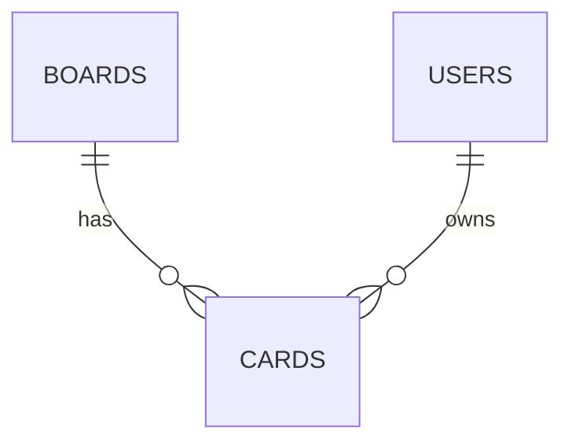

# Data map

- **Built:** YYYY-MM-DD at commit <short sha>

## TL;DR
- Max 5 bullets: the core objects and how they relate

```mermaid
erDiagram
  BOARDS ||--o{ CARDS : has
  USERS ||--o{ CARDS : owns
```

## Watch out
- none
