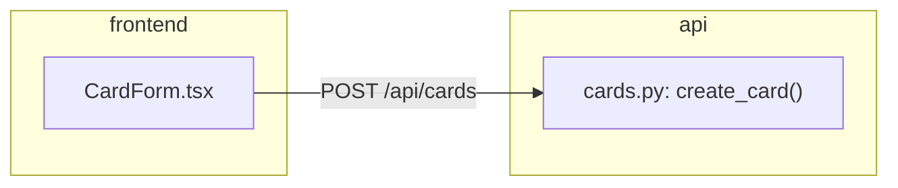

# System map

- **Built:** YYYY-MM-DD at commit <short sha>

## TL;DR
- Max 5 bullets: how the whole system works

```mermaid
flowchart LR
  subgraph frontend
    form["CardForm.tsx"]
  end
  subgraph api
    create["cards.py: create_card()"]
  end
  form -->|POST /api/cards| create
```

## Features added since mapping
- none yet

## Corrections
- none
